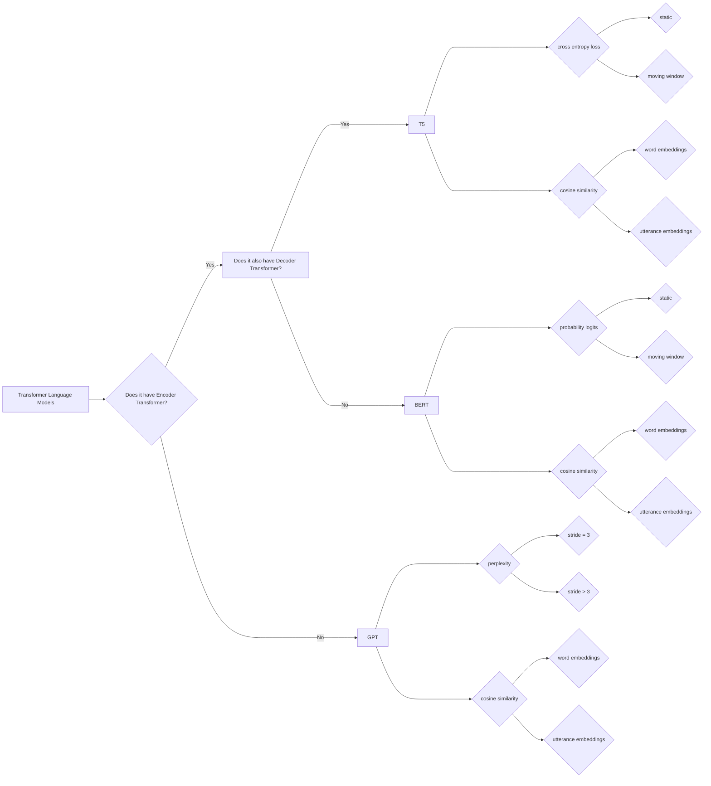

# scriptscz

---------------------------------------------

This folder contains various scripts and modified code (Python, R, shell) written or adapted by Yan Cong starting in August 2021 at The Feinstein Institutes for Medical Research.

There are five subfolders, each representing a different study. Each subfolder contains its own Readme file with a summary of the contents of that folder.

---------------------------------------------

The "classifiers" subfolder: build classifiers to capture speech disorganizations

The "ner" subfolder: name entity recognition in text files

The "pdtb" subfolder: use penn-discourse-treebank parser to annotate discourse relations

The "perplexity" subfolder: use transformers' perplexity metrics to understand speech incoherence

The "similarity" subfolder: use transformers' similarity metrics to understand speech inefficiency

